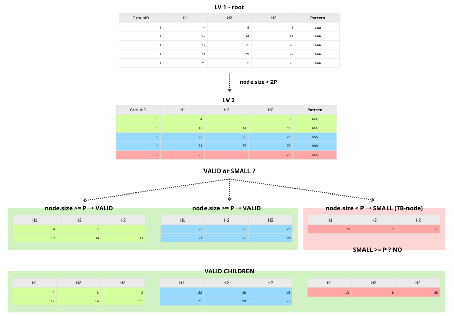

# Naive Algorithm (k,P)-Anonymity

## Panoramica

L'algoritmo Naive è un approccio *top-down* per l'anonimizzazione di serie temporali che mira a soddisfare il modello $(k,P)$-anonymity. L'obiettivo è pubblicare dati che proteggano l'identità (tramite $k$) e garantiscano che ogni pattern pubblicato sia condiviso da almeno $P$ individui.

## Fasi dell'Algoritmo

### 1. Fase 1: Partizionamento Valori (Mondrian)

Vengono raggruppati i record in **k-group** basandosi sui valori delle serie temporali (Value Domain). L'algoritmo Mondrian divide ricorsivamente il dataset cercando di minimizzare l'ampiezza dell'envelope (Instant Value Loss) finché i gruppi non possono più essere divisi senza violare la dimensione minima $k$ (quindi $size \ge k$).

Una volta creati i gruppi, l'algoritmo valuta la qualità dell'anonimizzazione calcolando la **Value Loss (VL)**. Per ogni gruppo, viene definito un "Envelope" (una fascia che racchiude tutte le serie temporali del gruppo tra un limite minimo e massimo). La VL quantifica l'ampiezza media di questa fascia: più il valore è basso, più le serie nel gruppo sono simili tra loro e minore è la perdita di precisione dei dati.

### 2. Fase 2: Raffinamento del Pattern (Naive Node Splitting)

Una volta ottenuti i k-group basati sui valori, l'algoritmo esegue una procedura ricorsiva Top-Down per suddividere ulteriormente ogni gruppo in P-subgroups, cercando di massimizzare il dettaglio della forma della curva (Pattern SAX).

*   **Pre-processing (PAA):**
    Le serie temporali (es. 8 punti) vengono preliminarmente ridotte a 4 segmenti tramite Piecewise Aggregate Approximation (PAA). Questo passaggio riduce la dimensionalità e mitiga il rumore prima della discretizzazione simbolica.

*   **Discretizzazione Gerarchica (SAX Level):**
    L'algoritmo tenta di descrivere le curve con una precisione crescente, aumentando progressivamente il parametro *level* (che corrisponde alla cardinalità dell'alfabeto SAX, ovvero in quante fasce viene diviso l'asse delle Y).
    *   **Livello Base (1):** Si parte da una descrizione generica (bassa risoluzione).
    *   **Livelli Successivi:** Si tenta di aumentare il livello (split) per distinguere meglio le curve all'interno del gruppo.

*   **Il Ruolo del MAX_LEVEL:**
    È stato imposto un tetto massimo di raffinamento ``MAX_LEVEL = 5``.
    *   *Significato:* Al massimo dettaglio, l'algoritmo utilizzerà un alfabeto di 5 simboli (es. 'a', 'b', 'c', 'd', 'e') per descrivere l'altezza di ogni segmento.
    *   *Logica di Arresto:* La ricorsione si ferma quando:
        1.  Si raggiunge il MAX_LEVEL (massima precisione consentita).
        2.  Non è possibile aumentare il livello senza violare il vincolo di privacy $P$ (il gruppo diventerebbe troppo piccolo, $< P$, o i record non avrebbero più lo stesso pattern).
    *   *Motivazione:* Un `max_level` troppo alto aumenterebbe la precisione del pattern (riducendo il Pattern Loss), ma renderebbe estremamente difficile trovare $P$ record identici, costringendo l'algoritmo a sopprimere troppi dati. Il valore 5 rappresenta un compromesso tra la fedeltà della forma e la garanzia di anonimato.

*   **Ottimizzazione "In-Place" (Zoom senza Scissione):**
    Quando un gruppo ha dimensioni intermedie ($P \le Size < 2P$), non può essere diviso ulteriormente (poiché genererebbe figli con meno di $P$ elementi). In questo caso, l'algoritmo adotta una strategia di "raffinamento sul posto":
    *   **Tentativo di Zoom:** Invece di dividere il nodo, prova ad aumentare il livello SAX per l'intero gruppo unito.
    *   **Test di Omogeneità:** Ricalcola i pattern di tutti i membri al livello successivo. Se tutti i record risultano ancora identici tra loro con la nuova risoluzione, il livello del gruppo viene aggiornato permanentemente.
    *   **Risultato:** Questo permette di ridurre il Pattern Loss anche per i gruppi che non possono essere splittati, garantendo la massima precisione possibile compatibilmente con il vincolo di omogeneità del pattern.

### 3. Fase 3: Post-processing e Gestione delle "Bad Leafs"

Durante la suddivisione ricorsiva nella Fase 2, è possibile che vengano generati dei nodi foglia che contengono meno di $P$ record. Questi nodi sono definiti *Bad Leafs* e violano il requisito di $P$-anonymity. Per risolvere il problema, l'algoritmo esegue una fase di post-processing.

#### Flusso di Esecuzione
1.  **Raccolta e Ordinamento:** Tutte le *bad leafs* vengono rimosse dall'albero e inserite in una coda di priorità (heap), ordinate in modo crescente in base alla loro dimensione (numero di record).
2.  **Merging (Unione):** L'algoritmo processa le *bad leafs* una alla volta e tenta di unirle a una "Good Leaf" (un nodo valido con $size \ge P$) esistente.
3.  **Criterio di Scelta:** Il nodo di destinazione viene scelto cercando la massima similitudine del pattern (ovvero la minima Pattern Loss).
4.  **Spareggio:** In caso di parità (distanze uguali verso più nodi), viene scelto il nodo di destinazione con la dimensione minore.
5.  **Sovrascrittura:** Una volta uniti, i record della *bad leaf* perdono il loro pattern originale e assumono la rappresentazione del pattern (PR) della *good leaf* ospitante.

#### Calcolo della Similitudine e Decisione di Merging
Una volta ottenuti i Feature Vectors (FV), l'algoritmo deve decidere a quale Good Leaf unire la Bad Leaf. L'obiettivo è minimizzare la Pattern Loss, definita come $1 - \text{CosineSimilarity}$.

**Esempio di Calcolo (Scenario Teorico)**
Supponiamo lo scenario seguente basato sui centroidi SAX:
*   **Bad Leaf (da salvare):** `abb` $\rightarrow FV_{abb} = [+0.97, 0, +0.97]$
*   **Good Leaf 1 (Candidato A):** `abc` $\rightarrow FV_{abc} = [+0.97, +0.97, +1.94]$
*   **Good Leaf 2 (Candidato B):** `cba` $\rightarrow FV_{cba} = [-0.97, -0.97, -1.94]$

I calcoli eseguiti per determinare il vincitore sono:
*   **Confronto A: abb vs abc (Simili?)**
    *   Prodotto Scalare: $(0.97 \times 0.97) + (0 \times 0.97) + (0.97 \times 1.94) = \mathbf{2.82}$
    *   Magnitudini: $\|FV_{abb}\| \approx 1.37$, $\|FV_{abc}\| \approx 2.37$. Prodotto $\approx 3.25$.
    *   Risultato: $\text{Similarity} = 2.82 / 3.25 \approx \mathbf{0.868}$.
    *   Pattern Loss: $1 - 0.868 = \mathbf{0.132}$ (Molto bassa).

*   **Confronto B: abb vs cba (Opposti?)**
    *   Prodotto Scalare: $(0.97 \times -0.97) + ... = \mathbf{-2.82}$.
    *   Risultato: $\text{Similarity} \approx \mathbf{-0.868}$.
    *   Pattern Loss: $1 - (-0.868) = \mathbf{1.868}$ (Molto alta).

**Verdetto:** La Bad Leaf viene unita al gruppo `abc`, preservando il trend di salita.

> [!NOTE]
> **Nota di Implementazione: Ottimizzazione sui Dati Reali**
>
> Mentre il paper suggerisce di confrontare la rappresentazione del pattern della Bad Leaf ($PR_{bad}$) con quella della Good Leaf ($PR_{good}$), l'implementazione attuale adotta una strategia più precisa:
> *   **Metodo Paper (Teorico):** Confronta $FV(\text{SAX}_{\text{bad}})$ vs $FV(\text{SAX}_{\text{good}})$.
> *   **Metodo Implementato:** Confronta $FV(\text{DatiReali}_{\text{bad}})$ vs $FV(\text{SAX}_{\text{good}})$.
>
> **Motivazione:** Una Bad Leaf contiene spesso pochissimi record (es. 1 solo). Convertire questo singolo record in una stringa SAX introduce immediatamente un errore di approssimazione (discretizzazione). Utilizzando invece la media dei dati grezzi (Ground Truth) della Bad Leaf, eliminiamo l'errore iniziale di quantizzazione e troviamo il gruppo di destinazione che meglio accoglie la forma reale della curva, minimizzando la distorsione semantica nel dataset finale.

## Metriche di Performance

La valutazione è stata effettuata su un dataset strutturato di test (200 record) configurando l'algoritmo con parametri $K=8$ e $P=2$. Le metriche seguono le definizioni formali proposte da Shou et al. nel paper di riferimento.

| Metrica | Valore | Descrizione e Note Tecniche |
| --- | --- | --- |
| **Tempo di Esecuzione** | **< 0.1s** | L'algoritmo mostra un'efficienza elevata su dataset ridotti. La complessità teorica è $O(max\text{-}level \cdot N)$. |
| **Avg Instant Value Loss (VL)** | **~8.42** | Rappresenta la perdita di precisione puntuale, calcolata come media quadratica (RMS) dell'ampiezza degli *envelopes* generati. Un valore contenuto indica che i gruppi formati hanno una bassa varianza interna in termini di valori assoluti. |
| **Avg Pattern Loss (PL)** | **~0.09** | Misura la distorsione della forma delle curve (similarità) nello spazio delle caratteristiche.   Il valore estremamente basso (equivalente a una similarità del **91%**) conferma l'efficacia della strategia di post-processing implementata: il merging delle *Bad Leafs* basato sulla **media dei dati grezzi** (anziché sulle stringhe SAX) preserva fedelmente i trend originali. |
| **Range Query Error** | **~8.1%** | Errore relativo contenuto sulle query di intervallo. |

### Dettaglio delle Formule Utilizzate

**1. Instant Value Loss (VL)**
Misura la "sfocatura" dei dati causata dalla generalizzazione. Per ogni serie temporale, viene calcolata la radice quadrata della media dei quadrati delle differenze tra i limiti superiori ($U_t$) e inferiori ($L_t$) dell'envelope su tutti i punti temporali $T$:

$$ VL = \sqrt{\frac{1}{T} \sum_{t=1}^{T} (U_t - L_t)^2} $$

La metrica globale è la somma o la media di $VL$ su tutto il dataset.

**2. Pattern Loss (PL)**
Misura quanto la forma della serie ricostruita ($Q'$) differisce dall'originale ($Q$). È calcolata utilizzando la distanza nello spazio delle caratteristiche (Feature Space). Come specificato nel paper, si utilizza la distanza basata sul coseno:

$$ PL(Q, Q') = 1 - \text{CosineSimilarity}(FV_Q, FV_{Q'}) $$

Dove $FV$ è il vettore delle caratteristiche composto dalle differenze a coppie tra gli attributi.

## Struttura Dataset

Il file CSV prodotto (`naive_anonymized.csv`) presenta la seguente struttura:

*   **GroupID**: Identificativo numerico del gruppo di anonimato ($k$-group).
*   **H1...H8**: Valori delle serie temporali generalizzati come intervalli stringa `[min-max]`.
*   **Performance_SD**: Attributo sensibile (Quasi-Identifier categoriale o Sensibile, lasciato invariato).
*   **Pattern**: Rappresentazione SAX finale del gruppo (es. "aaaa", "aabc", "edca"). Rappresenta la forma media del gruppo su 4 segmenti temporali.

## Dataset Files

*   [Raw Dataset](docs/data/dataset_raw.csv)
*   [Anonymized Dataset](docs/data/naive_anonymized.csv)