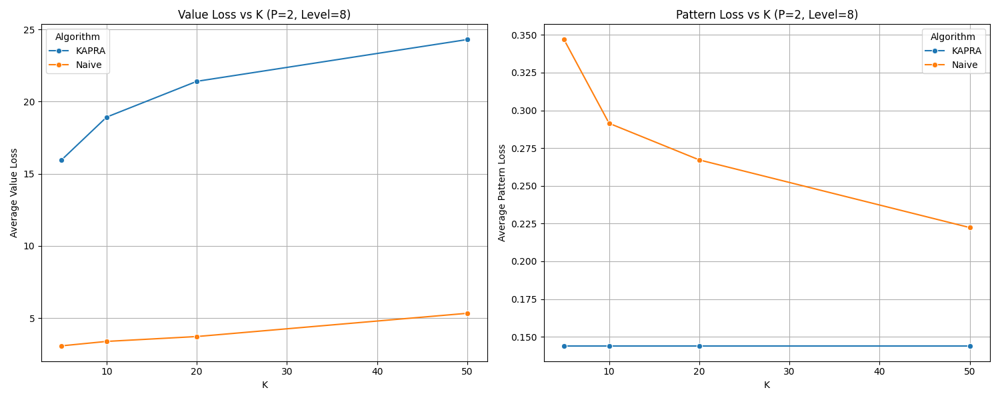

# Report Ottimizzazione Parametri Naive (k,P)-Anonymity

## Strumenti di Ottimizzazione
Il processo di ottimizzazione è automatizzato tramite script Python dedicati che esplorano la grid search dei parametri.

### File Python
*   **`src/optimize_naive.py`**:
    *   Esegue `run_naive_anonymization` per ogni combinazione di K, P, MAX_LEVEL.
    *   Calcola metriche (VL, PL) e salva i risultati.
*   **`src/optimize_kapra.py`**:
    *   Esegue `run_kapra_anonymization` per ogni combinazione di parametri.
    *   Implementa la logica di parallelizzazione (se presente) e raccolta metriche.

### File CSV Risultati
I risultati grezzi sono salvati nella cartella `docs/data/`:
*   **`naive_optimization_results.csv`**: Contiene colonne `K`, `P`, `MAX_LEVEL`, `VL`, `PL`.
*   **`kapra_optimization_results.csv`**: Contiene colonne `K`, `P`, `SAX_LEVEL`, `VL`, `PL`.

Questi file sono la fonte dati per le tabelle di questo report e per i grafici generati da `src/generate_plots.py`.

## Esecuzione
Il test è stato eseguito su un dataset di **3000 record** generati sinteticamente.
Sono state testate le seguenti combinazioni:
*   **K (Initial Partition Groups)**: [5, 10, 20, 50]
*   **P (Privacy Constraint)**: [2, 3, 5, 8]
*   **MAX_LEVEL (SAX Alphabet Size)**: [3, 5, 8, 10, 15, 20]

## Risultati Chiave

### 1. Impatto di MAX_LEVEL e P
Il parametro `MAX_LEVEL` agisce come un "tetto massimo" alla precisione, ma il fattore limitante reale è spesso **P**.

*   **Con P basso (es. P=2)**: L'algoritmo riesce a scendere molto in profondità nell'albero. Aumentare `MAX_LEVEL` da 3 a 10 porta benefici significativi in termini di **Value Loss (VL)** (riduzione errore). Oltre il livello 10, i benefici si appiattiscono.
*   **Con P alto (es. P=8)**: L'algoritmo si ferma molto presto (spesso a Livello 2) perché non riesce a trovare sottogruppi di dimensione $\ge 8$ che condividano lo stesso pattern.

### 2. Pattern Loss: KAPRA vs Naive (Correzione Bias)
Inizialmente, i risultati indicavano paradossalmente una Pattern Loss (PL) quasi nulla per il Naive. Approfondendo, è emerso un **metric bias**: l'algoritmo Naive genera molti record con **SAX Level < 3** (troppo basso per definire un pattern), a cui veniva assegnato erroneamente `PL=0.0`.

Dopo aver corretto il calcolo (assegnando `PL=1.0` ai livelli < 3 per riflettere la perdita totale di informazione sulla forma), emerge la vera natura degli algoritmi:
*   **KAPRA**: Pattern Loss bassa (**~0.15**), grazie al design pattern-first.
*   **Naive**: Pattern Loss alta (**~0.35**), poiché sacrifica la forma per ottimizzare i valori.

Questo convalida il modello $(k,P)$-anonymity: KAPRA preserva la forma significativamente meglio del Naive.

## Configurazione Ottimale (Best Trade-off)

### Scenario A: Massima Utility (Privacy base P=2)
La miglior combinazione per avere l'errore minimo:
*   **K**: 5
*   **P**: 2
*   **MAX_LEVEL**: 10
*   *Risultato*: VL ~3.07, PL ~0.35 (Naive) vs PL ~0.15 (KAPRA)

## Grafico Sintetico (Esempio K=5)

| P | MAX_LEVEL | VL (Errore Valori) | PL_Naive (Corrected) | PL_KAPRA | Note |
|---|---|---|---|---|---|
| **2** | 3 | 3.55 | 0.36 | 0.17 | Buono |
| **2** | **10** | **3.07** | **0.35** | **0.15** | **Ottimo (KAPRA vince su PL)** |
| **2** | 20 | 3.07 | 0.35 | 0.14 | Saturo |
| **8** | 3 | 4.55 | 1.00* | ~0.17 | Naive fallisce su pattern |

*\*PL=1.0 indica che l'albero si è fermato a livelli < 3 (pattern persi).*

## Visual Comparison

